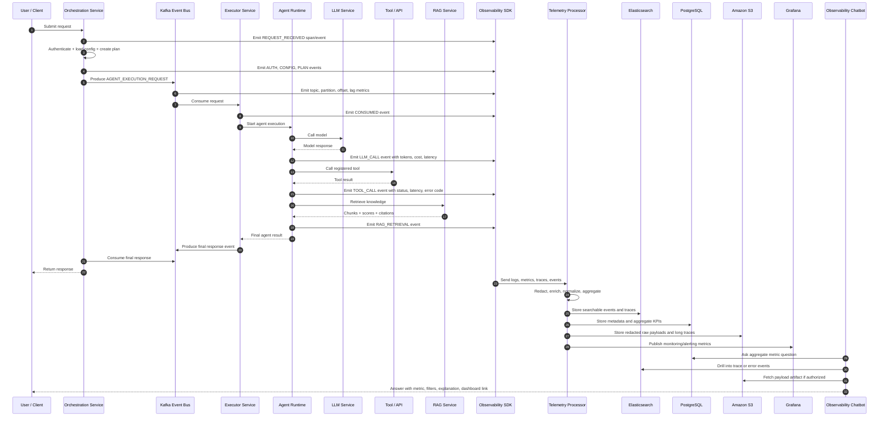
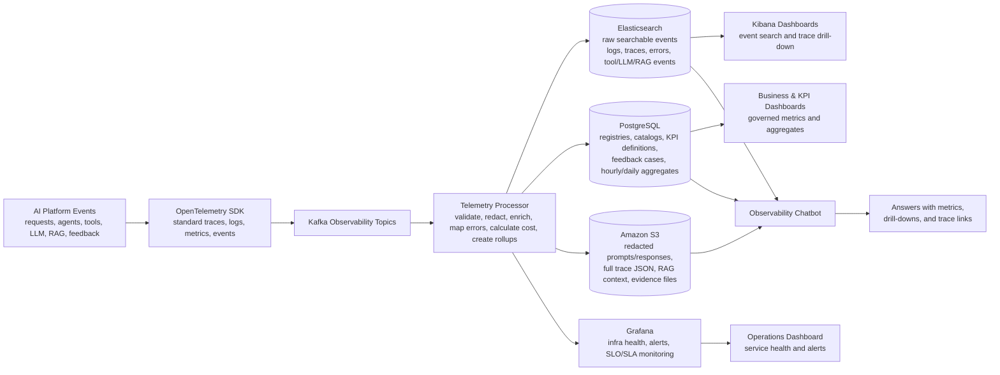
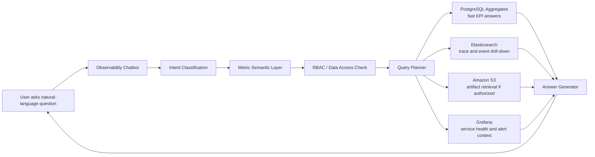

# AI Services Platform — Observability Plane Architecture

## 0. Context and Objective

The current AI Services Platform supports multiple AI execution styles, including:

- Normal prompt-based LLM requests
- RAG / knowledge retrieval flows
- Single-agent flows
- Multi-agent flows
- Loop-agent flows
- Tool-augmented agent workflows
- Guardrail-controlled execution
- Memory-enabled execution
- Async execution through Kafka

The goal is to build a complete **Observability Plane** that gives platform, application, and business teams visibility into:

- User requests
- Agent executions
- Agent steps
- LLM calls
- Token usage
- Cost
- RAG retrieval quality
- Tool calls
- Tool failures
- Guardrail decisions
- Memory usage
- User feedback
- Positive / negative sentiment
- Errors and root causes
- Business KPIs
- SLA / SLO health
- Natural-language Q&A through an Observability Chatbot

This document is an enhanced architecture and implementation plan based on the current platform design and dashboard requirements.

---

## 1. Updated Target Architecture

The updated architecture assumes:

- **Elasticsearch / Kibana** will continue to be used for logs, event search, trace search, and operational dashboards.
- **PostgreSQL** will be used for metadata, registry, KPI definitions, aggregate metric tables, and chatbot-ready summary data.
- **Amazon S3** will be used as the object store for redacted prompts, responses, traces, RAG contexts, audit files, and long payloads.
- **Grafana** will be used for infrastructure/platform monitoring, alerting, and service health dashboards.
- **Apache Kafka** will continue to support async agent execution and observability event streaming.
- **OpenTelemetry / Observability SDK** will standardize trace, metric, log, and event capture across the platform.

> Note: Grafana is primarily a visualization and alerting layer. It should connect to available data sources such as Elasticsearch, PostgreSQL, Kafka/JMX metrics, CloudWatch, or other enterprise monitoring sources.

---

## 2. Enhanced Architecture Diagram

```mermaid
flowchart LR

    subgraph SRC["1. Observability Data Sources"]
        UI["UI / Chat / Web App"]
        API["API Requests"]
        AGREG["Agent Registration"]
        TOOLREG["Tool Registration"]
        PROMPT["Prompt / RAG Requests"]
        FEEDBACK["User Feedback"]
        INFRA["System & Infra Signals"]
        EXT["External Integrations"]
    end

    subgraph PLATFORM["2. AI Services Platform"]
        CLIENT["Client / Application"]

        subgraph ORCH["Orchestration Service"]
            PLANNER["Planner"]
            RESP["Response Processor"]
            CONFIG["Config Loader"]
            AUTH["Auth / Access Check"]
        end

        KAFKA["Kafka Event Bus"]

        subgraph EXEC["Executor Service"]
            CONSUMER["Message Consumer"]
            AGENTORCH["Agent Orchestrator"]
            RUNTIME["Agent Execution Runtime"]
        end

        LLM["LLM / Model Services"]
        RAG["RAG / Knowledge Retrieval"]
        TOOLS["Tools / External APIs"]
        MEMORY["Memory Module"]
        GUARD["Guardrails / Policy Engine"]

        EVIDENCE["Evidence Store"]
        CASESTATE["Case State"]
        AUDIT["Audit Logs"]
    end

    subgraph COLLECT["3. Observability Collection"]
        SDK["OpenTelemetry SDK / Platform Instrumentation"]
        TRACES["Traces / Spans / Correlation IDs"]
        LOGS["Structured Logs"]
        METRICS["Metrics / Counters / Histograms"]
        EVENTS["Domain Events"]
        CUSTOM["Custom Signals: Tokens, Cost, Quality, Feedback"]
    end

    subgraph PIPE["4. Ingestion & Processing Pipeline"]
        OBSKAFKA["Kafka Observability Topics<br/>traces | logs | metrics | events | audit"]
        PROCESSOR["Telemetry Processor / Enrichment Layer<br/><br/>- Schema validation<br/>- PII redaction<br/>- Metadata enrichment<br/>- Error mapping<br/>- Token & cost calculation<br/>- Trace relationship building<br/>- Aggregation & rollup generation<br/>- SLA/SLO evaluation"]
    end

    subgraph STORE["5. Data & Storage Layer"]
        ES["Elasticsearch<br/><br/>Operational event store<br/>Logs, errors, traces, LLM/tool/RAG events, feedback search"]
        PG["PostgreSQL<br/><br/>Metadata + aggregates<br/>Registries, KPI definitions, error catalog, feedback cases, rollups"]
        S3["Amazon S3<br/><br/>Object store<br/>Redacted prompts, responses, full trace payloads, RAG contexts, uploaded docs, audit evidence"]
        GRAF["Grafana<br/><br/>Monitoring & alerting layer<br/>Infra dashboards, service health, Kafka lag, latency, alerts"]
    end

    subgraph PRESENT["6. Observability Presentation"]
        KIBANA["Kibana Dashboards<br/>Operational search and event analytics"]
        GFDASH["Grafana Dashboards<br/>Infrastructure, service health, alerting"]
        APPDASH["Application Overview<br/>SLA, usage, errors, latency"]
        AGENTDASH["Agent Observability<br/>success rate, steps, tool usage, cost"]
        RAGDASH["RAG Observability<br/>hit rate, no-result rate, relevance, citations"]
        TOOLDASH["Tool Health<br/>failures, retries, timeout, dependency health"]
        LLMVIEW["LLM Observability<br/>tokens, cost, latency, model errors"]
        FEEDVIEW["Feedback Analytics<br/>positive/negative, categories, trends"]
        TRACEVIEW["Trace Explorer<br/>end-to-end request drill-down"]
    end

    subgraph CHAT["7. Observability Chatbot"]
        BOT["Observability Chatbot"]
        INTENT["Intent Classification"]
        SEM["Metric Semantic Layer"]
        RBAC["RBAC / Access Control"]
        QP["Query Planner"]
        ANSWER["Answer Generator<br/>metric + filters + explanation + dashboard link"]
    end

    SRC --> CLIENT
    CLIENT --> AUTH
    AUTH --> CONFIG
    CONFIG --> PLANNER
    PLANNER --> KAFKA
    KAFKA --> CONSUMER
    CONSUMER --> AGENTORCH
    AGENTORCH --> RUNTIME
    RUNTIME --> LLM
    RUNTIME --> RAG
    RUNTIME --> TOOLS
    RUNTIME --> MEMORY
    RUNTIME --> GUARD
    RUNTIME --> CASESTATE
    RUNTIME --> EVIDENCE
    RUNTIME --> AUDIT
    RESP --> CLIENT

    CLIENT -. telemetry .-> SDK
    AUTH -. spans .-> SDK
    CONFIG -. config events .-> SDK
    PLANNER -. planner events .-> SDK
    KAFKA -. lag / offsets .-> SDK
    EXEC -. execution events .-> SDK
    LLM -. token / model metrics .-> SDK
    RAG -. retrieval quality .-> SDK
    TOOLS -. tool-call events .-> SDK
    MEMORY -. memory events .-> SDK
    GUARD -. policy events .-> SDK
    FEEDBACK -. feedback events .-> SDK

    SDK --> TRACES
    SDK --> LOGS
    SDK --> METRICS
    SDK --> EVENTS
    SDK --> CUSTOM

    TRACES --> OBSKAFKA
    LOGS --> OBSKAFKA
    METRICS --> OBSKAFKA
    EVENTS --> OBSKAFKA
    CUSTOM --> OBSKAFKA
    OBSKAFKA --> PROCESSOR

    PROCESSOR --> ES
    PROCESSOR --> PG
    PROCESSOR --> S3
    PROCESSOR --> GRAF

    ES --> KIBANA
    ES --> APPDASH
    ES --> AGENTDASH
    ES --> RAGDASH
    ES --> TOOLDASH
    ES --> LLMVIEW
    ES --> FEEDVIEW
    ES --> TRACEVIEW

    PG --> APPDASH
    PG --> AGENTDASH
    PG --> RAGDASH
    PG --> TOOLDASH
    PG --> LLMVIEW
    PG --> FEEDVIEW

    GRAF --> GFDASH
    GRAF --> APPDASH

    S3 --> TRACEVIEW

    BOT --> INTENT
    INTENT --> SEM
    SEM --> RBAC
    RBAC --> QP
    QP --> PG
    QP --> ES
    QP --> S3
    QP --> GRAF
    PG --> ANSWER
    ES --> ANSWER
    S3 --> ANSWER
    GRAF --> ANSWER
    ANSWER --> BOT
```



---

## 3. End-to-End Event Flow



---

## 4. Storage Architecture Without ClickHouse

Since ClickHouse is not available, the recommended architecture is:

| Layer | Technology | Purpose |
|---|---|---|
| Operational event store | **Elasticsearch** | Logs, traces, error search, recent analytics, Kibana dashboards |
| Metadata and aggregate store | **PostgreSQL** | Registries, KPI definitions, feedback cases, aggregate metrics, chatbot summary layer |
| Object store | **Amazon S3** | Redacted prompts, responses, long traces, RAG contexts, uploaded documents, audit evidence |
| Monitoring and alerting | **Grafana** | Infrastructure/service monitoring, Kafka lag, alerts, SLA/SLO health views |
| Dashboard layer | **Kibana + Grafana** | Kibana for event/log analytics; Grafana for service health and alerting |
| Chatbot data layer | **PostgreSQL + Elasticsearch + Amazon S3** | Aggregate answers, drill-down search, secure artifact retrieval |

### Recommended Data Flow

```text
AI Platform Components
    ↓
OpenTelemetry SDK / Observability Middleware
    ↓
Kafka Observability Topics
    ↓
Telemetry Processor / Enrichment Layer
    ↓
Elasticsearch + PostgreSQL + Amazon S3 + Grafana
    ↓
Kibana Dashboards + Grafana Dashboards + Observability Chatbot
```

---

## 5. Role of Each Storage Component

### 5.1 Elasticsearch

Use Elasticsearch for high-cardinality, searchable operational telemetry.

Store:

- Request events
- Response events
- Error events
- Agent step events
- LLM call events
- Tool call events
- RAG retrieval events
- Guardrail events
- Feedback events
- Trace spans
- Stack traces
- Exception logs

Suggested Elasticsearch indices:

```text
ai-observability-requests-*
ai-observability-agent-steps-*
ai-observability-llm-calls-*
ai-observability-tool-calls-*
ai-observability-rag-events-*
ai-observability-guardrail-events-*
ai-observability-feedback-*
ai-observability-errors-*
ai-observability-traces-*
```

Use Elasticsearch for questions such as:

- Show all failed traces for application `179524`.
- What errors occurred in the last 15 days?
- Which requests failed with `GR003`?
- Which tool calls timed out today?
- Show the full trace for this request.

---

### 5.2 PostgreSQL

Use PostgreSQL for structured metadata, governance, registries, and aggregated metrics.

Store:

- Application registry
- Agent registry
- Tool registry
- Prompt template registry
- RAG registry
- Error code catalog
- KPI definitions
- Feedback cases
- Dashboard configurations
- Alert thresholds
- Hourly aggregate metrics
- Daily aggregate metrics
- Chatbot semantic metric catalog

Core tables:

```text
application_registry
agent_registry
tool_registry
prompt_template_registry
rag_registry
kpi_definition
error_code_catalog
feedback_case
metric_catalog
dashboard_config
alert_threshold
agg_hourly_application_metrics
agg_hourly_agent_metrics
agg_hourly_tool_metrics
agg_hourly_llm_metrics
agg_hourly_rag_metrics
agg_daily_feedback_metrics
agg_daily_kpi_metrics
```

Use PostgreSQL for questions such as:

- How many requests did an application process yesterday?
- What was the daily success rate?
- Which agent has the highest failure rate this week?
- What is the token cost by application this month?
- What is the negative feedback trend for an agent?

---

### 5.3 Amazon S3

Amazon S3 is the object store for large, semi-structured, or sensitive artifacts that should not live directly in Elasticsearch or PostgreSQL.

Store:

- Redacted prompts
- Redacted model responses
- Full trace JSON payloads
- RAG retrieved contexts
- Uploaded documents
- Audit evidence files
- Long request/response payloads
- Debug bundles
- Offline RCA artifacts

Example S3 layout:

```text
s3://ai-observability-prod/
  raw/
    year=2026/month=05/day=13/application_id=179524/trace_id=abc123.json
  redacted-prompts/
    year=2026/month=05/day=13/application_id=179524/trace_id=abc123.json
  rag-contexts/
    year=2026/month=05/day=13/application_id=179524/trace_id=abc123.json
  audit-evidence/
    year=2026/month=05/day=13/application_id=179524/evidence_id=ev123.json
  debug-bundles/
    year=2026/month=05/day=13/application_id=179524/trace_id=abc123.zip
```

Store only references in Elasticsearch/PostgreSQL:

```json
{
  "trace_id": "trace_abc123",
  "application_id": "179524",
  "raw_payload_s3_uri": "s3://ai-observability-prod/redacted-prompts/year=2026/month=05/day=13/application_id=179524/trace_id=abc123.json",
  "rag_context_s3_uri": "s3://ai-observability-prod/rag-contexts/year=2026/month=05/day=13/application_id=179524/trace_id=abc123.json"
}
```

Recommended S3 controls:

- Server-side encryption with KMS
- Bucket policies by environment
- Application-level folder partitioning
- Retention lifecycle policies
- Restricted access to raw payloads
- Redaction before write
- Audit logging for reads
- Object versioning for audit evidence if required

---

### 5.4 Grafana

Use Grafana for infrastructure, platform health, and alerting dashboards.

Grafana should cover:

- Service availability
- Pod/container health
- CPU / memory
- API latency
- Kafka lag
- Kafka throughput
- Executor queue backlog
- Error-rate alerts
- SLA/SLO burn-rate alerts
- LLM latency alerts
- Tool failure alerts
- RAG no-result spike alerts
- Negative feedback spike alerts

Recommended Grafana data sources:

- Elasticsearch
- PostgreSQL
- CloudWatch or enterprise infra metrics source
- Kafka/JMX metrics exporter
- Kubernetes metrics source, if available
- Alertmanager or enterprise notification system, if available


---

### 5.5 End-to-End Storage Component Mapping

This table maps every major observability data category to the correct storage component. The intent is to keep each storage layer focused: **Elasticsearch for searchable operational events**, **PostgreSQL for governed metadata and aggregates**, **Amazon S3 for large payloads/artifacts**, and **Grafana for monitoring and alerting views**.

| Storage Component | Data / Information Stored | Physical Object | Grain / Level | Purpose | Typical Consumers |
|---|---|---|---|---|---|
| **Elasticsearch** | Request, response, and error events | `ai-observability-requests-*`, `ai-observability-errors-*` | One document per event | Searchable operational telemetry and troubleshooting | Kibana dashboards, trace explorer, chatbot drill-down |
| **Elasticsearch** | Agent step events | `ai-observability-agent-steps-*` | One document per agent step/span | Agent execution visibility, step-level failures, loop analysis | Agent dashboard, RCA workflow, chatbot |
| **Elasticsearch** | LLM call events | `ai-observability-llm-calls-*` | One document per model call | Model latency, model errors, token traces, prompt-template failures | LLM dashboard, token/cost analysis, chatbot |
| **Elasticsearch** | Tool call events | `ai-observability-tool-calls-*` | One document per tool/API call | Tool success/failure analysis, timeouts, retries, dependency health | Tool dashboard, incident analysis, chatbot |
| **Elasticsearch** | RAG retrieval events | `ai-observability-rag-events-*` | One document per retrieval/generation event | Retrieval quality, no-result rate, citation coverage, vector/search errors | RAG dashboard, knowledge-base owners, chatbot |
| **Elasticsearch** | Guardrail and policy events | `ai-observability-guardrail-events-*` | One document per guardrail decision | Safety, policy, PII redaction, blocked-stage analysis | Guardrail dashboard, compliance review, chatbot |
| **Elasticsearch** | Feedback search events | `ai-observability-feedback-*` | One document per feedback event | Fast search of feedback linked to traces and responses | Feedback dashboard, quality review, chatbot |
| **Elasticsearch** | Full trace/searchable spans metadata | `ai-observability-traces-*` | One document per span or trace summary | End-to-end trace drill-down by `trace_id` / `span_id` | Trace explorer, RCA, chatbot |
| **PostgreSQL** | Application registry | `application_registry` | One row per application | Application ownership, filtering, access control, SOE/LOB mapping | Dashboards, chatbot, alert routing |
| **PostgreSQL** | Agent registry | `agent_registry` | One row per agent/version | Agent ownership, version tracking, type classification | Agent dashboard, chatbot, governance |
| **PostgreSQL** | Tool registry | `tool_registry` | One row per tool/version | Tool metadata, SLA, endpoint, owner mapping | Tool dashboard, RCA, chatbot |
| **PostgreSQL** | Prompt template registry | `prompt_template_registry` | One row per template/version | Prompt governance, version control, model mapping | LLM dashboard, prompt analysis, chatbot |
| **PostgreSQL** | RAG registry | `rag_registry` | One row per knowledge base/index | Knowledge-base ownership, vector index, embedding model mapping | RAG dashboard, chatbot, governance |
| **PostgreSQL** | Error code catalog | `error_code_catalog` | One row per error code | Standardized error definitions, severity, category, runbook | Error dashboard, alerting, RCA chatbot |
| **PostgreSQL** | KPI definitions | `kpi_definition` | One row per KPI | Business KPI formulas, thresholds, ownership, reportability | KPI dashboard, business reporting, chatbot |
| **PostgreSQL** | Feedback cases | `feedback_case` | One row per user/SME feedback item | Feedback workflow, sentiment, category, resolution status | Feedback dashboard, quality improvement, chatbot |
| **PostgreSQL** | Dashboard configurations | `dashboard_config` | One row per dashboard/widget configuration | Dashboard metadata, filters, ownership, visibility | Dashboard service, admin UI |
| **PostgreSQL** | Alert thresholds | `alert_threshold` | One row per alert rule/threshold | Alert configuration, threshold, window, severity, routing | Grafana alerts, incident routing |
| **PostgreSQL** | Chatbot semantic metric catalog | `metric_catalog` | One row per governed metric | Metric names, aliases, formulas, dimensions, approved sources | Observability chatbot, dashboard consistency |
| **PostgreSQL** | Hourly application metrics | `agg_hourly_application_metrics` | One row per application per hour | Fast application-level rollups | Executive dashboard, chatbot, SLA reporting |
| **PostgreSQL** | Hourly agent metrics | `agg_hourly_agent_metrics` | One row per agent per hour | Fast agent-level rollups | Agent dashboard, chatbot |
| **PostgreSQL** | Hourly tool metrics | `agg_hourly_tool_metrics` | One row per tool per hour | Fast tool health and dependency rollups | Tool dashboard, chatbot, alerting |
| **PostgreSQL** | Hourly LLM metrics | `agg_hourly_llm_metrics` | One row per model / prompt / agent per hour | Token, cost, latency, and model reliability rollups | LLM dashboard, cost dashboard, chatbot |
| **PostgreSQL** | Hourly RAG metrics | `agg_hourly_rag_metrics` | One row per RAG source per hour | Retrieval quality and no-result rollups | RAG dashboard, chatbot |
| **PostgreSQL** | Daily feedback metrics | `agg_daily_feedback_metrics` | One row per app/agent/day | Feedback sentiment and quality trend rollups | Feedback dashboard, leadership reporting |
| **PostgreSQL** | Daily KPI metrics | `agg_daily_kpi_metrics` | One row per KPI/app/agent/day | Business KPI values, trends, threshold status | KPI dashboard, business stakeholders, chatbot |
| **Amazon S3** | Redacted prompts and responses | `s3://ai-observability-*/redacted-prompts/`, `s3://ai-observability-*/redacted-responses/` | One object per trace/request | Secure archive of large or sensitive model payloads | Trace drill-down, audit, controlled chatbot retrieval |
| **Amazon S3** | Full trace JSON payloads | `s3://ai-observability-*/raw-traces/` | One object per trace | Complete end-to-end trace archive beyond searchable metadata | RCA, audit, offline analysis |
| **Amazon S3** | RAG contexts and retrieved chunks | `s3://ai-observability-*/rag-contexts/` | One object per RAG request/trace | Store retrieved context without bloating Elasticsearch/PostgreSQL | RAG quality review, audit, chatbot with access checks |
| **Amazon S3** | Uploaded documents and evidence artifacts | `s3://ai-observability-*/uploaded-documents/`, `s3://ai-observability-*/audit-evidence/` | One object per file/artifact | Long-term artifact storage with retention controls | Audit review, compliance, RCA |
| **Amazon S3** | Debug bundles and offline RCA exports | `s3://ai-observability-*/debug-bundles/` | One object per incident/trace bundle | Exportable investigation package | Support teams, incident review |
| **Grafana** | Infrastructure and service health metrics | Dashboards backed by infra data sources | Time-series metric | Visualize CPU, memory, pod health, API latency, Kafka lag, availability | Platform SRE, operations, leadership |
| **Grafana** | Alert rules and notifications | Grafana alert rules using `alert_threshold` definitions where applicable | One alert rule per metric/condition | Alerting, incident notification, SLO/SLA monitoring | SRE, support teams, app owners |
| **Kibana** | Operational dashboards over Elasticsearch | Kibana data views and dashboards | Event/log analytics view | Event search, error analysis, trace drill-down | App teams, support teams, platform team |

### 5.6 PostgreSQL Table Responsibility Map

The following table maps the PostgreSQL store items to their core tables. These tables form the **control plane, governance layer, KPI layer, aggregate layer, and chatbot semantic layer**.

| Information Area | Core Table | Description | Key Columns | Updated By | Used By |
|---|---|---|---|---|---|
| Application registry | `application_registry` | Registered applications using the AI Services Platform | `application_id`, `application_name`, `app_container`, `csi_id`, `soe_id`, `lob`, `owner_team`, `environment`, `status` | App onboarding flow / admin UI | Dashboard filters, chatbot, RBAC, alert routing |
| Agent registry | `agent_registry` | Registered agents and their ownership/version details | `agent_id`, `application_id`, `agent_name`, `agent_version`, `agent_type`, `framework`, `owner_team`, `active_flag` | Agent registration UI / platform API | Agent dashboard, trace enrichment, KPI mapping |
| Tool registry | `tool_registry` | Registered tools/connectors used by agents | `tool_id`, `application_id`, `tool_name`, `tool_type`, `endpoint`, `version`, `owner_team`, `sla_ms`, `active_flag` | Tool registration UI / platform API | Tool health, failed tool-call analysis, chatbot |
| Prompt template registry | `prompt_template_registry` | Prompt templates and versions used by agents/workflows | `prompt_template_id`, `agent_id`, `template_name`, `template_version`, `model_name`, `active_flag` | Prompt management service | Prompt failure analysis, LLM dashboard, cost analysis |
| RAG registry | `rag_registry` | RAG/knowledge-base configuration and ownership | `rag_id`, `application_id`, `knowledge_base_name`, `vector_index_name`, `embedding_model`, `refresh_frequency`, `owner_team`, `active_flag` | RAG admin/config service | RAG dashboard, retrieval quality analysis, chatbot |
| Error code catalog | `error_code_catalog` | Standard platform/agent/tool/LLM/RAG error definitions | `error_code`, `error_category`, `severity`, `description`, `runbook_url`, `owner_team` | Platform engineering / SRE | Error dashboards, RCA, chatbot, alerts |
| KPI definitions | `kpi_definition` | Business and operational KPI definitions | `kpi_id`, `application_id`, `agent_id`, `kpi_name`, `kpi_category`, `formula`, `data_source`, `threshold_green`, `threshold_yellow`, `threshold_red`, `owner`, `active_flag` | KPI admin / product owners | KPI dashboard, business scorecards, chatbot |
| Feedback cases | `feedback_case` | User/SME feedback linked to traces and responses | `feedback_id`, `trace_id`, `application_id`, `agent_id`, `rating`, `thumbs`, `sentiment`, `category`, `comment_redacted`, `status`, `linked_incident_id` | Feedback UI / chatbot / review workflow | Feedback dashboard, RCA, model improvement workflow |
| Metric catalog | `metric_catalog` | Governed metric dictionary and chatbot semantic layer | `metric_id`, `metric_name`, `metric_aliases`, `metric_category`, `formula`, `source_table`, `time_grain`, `dimensions`, `owner`, `active_flag` | Platform analytics team | Observability chatbot, dashboards, metric consistency |
| Dashboard configurations | `dashboard_config` | Dashboard and widget metadata/configuration | `dashboard_id`, `dashboard_name`, `dashboard_type`, `owner_team`, `filters_json`, `widgets_json`, `visibility`, `active_flag` | Dashboard admin/config UI | Kibana/Grafana/custom dashboard layer |
| Alert thresholds | `alert_threshold` | Alert conditions for applications, agents, tools, LLMs, RAG, feedback, and infra | `alert_id`, `metric_id`, `application_id`, `agent_id`, `tool_id`, `threshold_value`, `comparison_operator`, `window_minutes`, `severity`, `notification_channel`, `active_flag` | SRE / app owners | Grafana alerts, incident routing, SLA/SLO monitoring |
| Hourly application metrics | `agg_hourly_application_metrics` | Hourly app-level metrics | `hour_timestamp`, `application_id`, `request_count`, `success_count`, `error_count`, `avg_latency_ms`, `p95_latency_ms`, `total_tokens`, `estimated_cost` | Aggregation job / stream processor | Executive dashboard, app dashboard, chatbot |
| Hourly agent metrics | `agg_hourly_agent_metrics` | Hourly agent-level execution metrics | `hour_timestamp`, `application_id`, `agent_id`, `request_count`, `success_count`, `error_count`, `avg_latency_ms`, `p95_latency_ms`, `avg_step_count`, `loop_count`, `handoff_count` | Aggregation job / stream processor | Agent dashboard, chatbot |
| Hourly tool metrics | `agg_hourly_tool_metrics` | Hourly tool/connecter reliability metrics | `hour_timestamp`, `application_id`, `agent_id`, `tool_id`, `tool_call_count`, `tool_success_count`, `tool_failure_count`, `timeout_count`, `retry_count`, `p95_latency_ms`, `top_error_code` | Aggregation job / stream processor | Tool dashboard, RCA, chatbot, alerts |
| Hourly LLM metrics | `agg_hourly_llm_metrics` | Hourly model usage, token, cost, and reliability metrics | `hour_timestamp`, `application_id`, `agent_id`, `model_provider`, `model_name`, `prompt_template_id`, `llm_call_count`, `input_tokens`, `output_tokens`, `total_tokens`, `estimated_cost`, `error_count`, `p95_latency_ms` | Aggregation job / stream processor | LLM/token/cost dashboard, chatbot |
| Hourly RAG metrics | `agg_hourly_rag_metrics` | Hourly RAG retrieval and quality metrics | `hour_timestamp`, `application_id`, `agent_id`, `rag_id`, `rag_request_count`, `no_result_count`, `retrieval_latency_ms`, `avg_relevance_score`, `citation_coverage_pct`, `context_truncation_count` | Aggregation job / stream processor | RAG dashboard, chatbot, knowledge owners |
| Daily feedback metrics | `agg_daily_feedback_metrics` | Daily feedback and sentiment rollups | `metric_date`, `application_id`, `agent_id`, `positive_feedback_count`, `negative_feedback_count`, `neutral_feedback_count`, `avg_rating`, `top_feedback_category` | Daily aggregation job | Feedback dashboard, quality review, leadership reporting |
| Daily KPI metrics | `agg_daily_kpi_metrics` | Daily calculated KPI values | `metric_date`, `kpi_id`, `application_id`, `agent_id`, `kpi_value`, `target_value`, `status`, `threshold_breach_flag`, `trend_direction` | KPI calculation job | KPI dashboard, chatbot, business stakeholders |

### 5.7 Storage Responsibility Diagram



---

## 6. What to Capture

### 6.1 Platform Request Level

Capture one record per platform request.

| Field | Description |
|---|---|
| `trace_id` | End-to-end correlation ID |
| `request_id` | Unique request ID |
| `conversation_id` | Chat/session conversation ID |
| `application_id` | Application/CSI ID |
| `app_container` | Application container |
| `soe_id` | Service owner/business ID |
| `tenant_id` / `lob` | Tenant or line of business |
| `user_hash` | Hashed user identifier |
| `channel` | UI, API, webhook, batch |
| `request_type` | prompt, RAG, single-agent, multi-agent, loop-agent |
| `status` | success, failed, partial, timeout |
| `latency_ms` | End-to-end latency |
| `error_code` | Standard error code |
| `http_status` | HTTP response status |
| `input_tokens` | Total input tokens |
| `output_tokens` | Total output tokens |
| `total_tokens` | Total model tokens |
| `estimated_cost` | Estimated LLM cost |
| `feedback_available` | Boolean flag |

---

### 6.2 Orchestration Telemetry

Capture:

- Request received
- Auth success/failure
- Config load
- Agent selection
- Tool selection
- Prompt template selection
- Static/dynamic plan
- Kafka publish
- Response assembly
- Response delivery

Important events:

```text
REQUEST_RECEIVED
AUTH_COMPLETED
CONFIG_LOADED
PLAN_CREATED
AGENT_EXECUTION_REQUEST_PRODUCED
FINAL_RESPONSE_CONSUMED
FINAL_RESPONSE_BUILT
RESPONSE_DELIVERED
```

---

### 6.3 Kafka Telemetry

Capture:

| Metric | Description |
|---|---|
| `topic` | Kafka topic |
| `partition` | Kafka partition |
| `offset` | Message offset |
| `consumer_group` | Consumer group |
| `producer_latency_ms` | Time to publish |
| `consumer_latency_ms` | Time to consume |
| `kafka_lag` | Consumer lag |
| `message_size_bytes` | Event size |
| `retry_count` | Retry count |
| `dlq_flag` | Whether event went to DLQ |

---

### 6.4 Agent Telemetry

Capture:

- Agent ID
- Agent version
- Agent type
- Agent execution mode
- Step count
- Loop count
- Handoff count
- Planner decision
- Agent status
- Agent latency
- Agent error code
- Termination reason
- Tools used
- Models used
- RAG knowledge bases used
- Feedback score

Useful metrics:

- Agent success rate
- Agent failure rate
- Agent timeout rate
- Average steps per request
- Loop-agent max-loop rate
- Multi-agent handoff success rate
- Cost per agent run
- Negative feedback rate by agent

---

### 6.5 LLM Telemetry

Capture every model call.

| Field | Description |
|---|---|
| `model_provider` | Vertex AI, internal, etc. |
| `model_name` | Model name |
| `model_version` | Version |
| `prompt_template_id` | Prompt template |
| `prompt_template_version` | Template version |
| `temperature` | Model temperature |
| `input_tokens` | Input tokens |
| `output_tokens` | Output tokens |
| `total_tokens` | Total tokens |
| `estimated_cost` | Cost estimate |
| `latency_ms` | Model latency |
| `time_to_first_token_ms` | Streaming metric |
| `retry_count` | Retry attempts |
| `rate_limit_hit` | Rate-limit flag |
| `safety_blocked` | Safety block flag |
| `finish_reason` | stop, length, safety, error |
| `llm_error_code` | Model/provider error |

---

### 6.6 Tool-Call Telemetry

Capture every tool invocation.

| Field | Description |
|---|---|
| `tool_id` | Tool registry ID |
| `tool_name` | Tool name |
| `tool_version` | Tool version |
| `tool_type` | REST, DB, ServiceNow, RAG, internal API |
| `input_schema_valid` | Input validation result |
| `status` | success, failed, timeout |
| `http_status` | HTTP status |
| `error_code` | Tool error |
| `latency_ms` | Tool latency |
| `retry_count` | Retry count |
| `response_size_bytes` | Response payload size |
| `called_by_agent_id` | Agent that invoked the tool |

---

### 6.7 RAG Telemetry

Capture the complete RAG chain.

| Area | Capture |
|---|---|
| Query | query hash, rewritten query, query type |
| Embedding | embedding model, latency, errors |
| Retrieval | vector DB/index, top-k, chunk count |
| Ranking | reranker, score, latency |
| Grounding | citation coverage, source docs used |
| Context | context tokens, truncation flag |
| Quality | answer relevance, faithfulness, hallucination-risk signal |
| Permissions | access filters, denied chunks |
| Freshness | doc version, stale document flag |
| Failure | no-result, timeout, vector DB error |

RAG KPIs:

- RAG hit rate
- No-result rate
- Average relevance score
- Citation coverage %
- Context truncation rate
- Retrieval latency
- RAG feedback score
- Low-confidence answer rate

---

### 6.8 Guardrail Telemetry

Capture:

- Policy ID
- Policy version
- Decision: allow, block, redact, escalate
- Risk score
- Violation type
- Redaction applied
- Blocked stage: input, tool, output
- Guardrail latency
- False-positive feedback

---

### 6.9 Memory Telemetry

Capture:

- Memory read count
- Memory write count
- Memory retrieval latency
- Memory hit rate
- Memory miss rate
- Memory source: session, long-term, episodic
- Memory update status
- Memory deletion/audit events

---

### 6.10 User Feedback Telemetry

Capture structured and free-text feedback.

| Field | Description |
|---|---|
| `feedback_id` | Feedback ID |
| `trace_id` | Linked request trace |
| `application_id` | Application |
| `agent_id` | Agent |
| `response_id` | Response ID |
| `rating` | 1–5 |
| `thumbs` | up/down |
| `sentiment` | positive, negative, neutral |
| `feedback_category` | wrong answer, slow, tool failed, irrelevant, unsafe |
| `free_text_comment_redacted` | Redacted text |
| `submitted_by_role` | user, CSO, SME, admin |
| `resolution_status` | open, reviewed, fixed |
| `linked_incident_id` | ServiceNow/Jira ID if applicable |

---

## 7. Standard Event Contract

Every component should emit a common event structure.

```json
{
  "event_id": "evt_123",
  "event_type": "TOOL_CALL_COMPLETED",
  "timestamp": "2026-05-13T18:10:00Z",
  "trace_id": "trace_abc",
  "span_id": "span_tool_01",
  "parent_span_id": "span_agent_02",
  "environment": "prod",
  "application_id": "179524",
  "app_container": "gssp-gs",
  "soe_id": "PricingDomeApp",
  "agent_id": "copilot_agent",
  "agent_version": "1.0.3",
  "request_type": "multi_agent",
  "component": "executor_service",
  "status": "failed",
  "latency_ms": 3200,
  "tool_id": "kb_search_tool",
  "tool_name": "Knowledge Search",
  "http_status": 500,
  "error_code": "TOOL_TIMEOUT",
  "error_description": "Tool call timed out",
  "retry_count": 2,
  "user_hash": "sha256_xxx",
  "metadata": {
    "kafka_topic": "agent_execution_request",
    "consumer_group": "executor-service",
    "s3_payload_uri": "s3://ai-observability-prod/redacted-prompts/year=2026/month=05/day=13/application_id=179524/trace_id=trace_abc.json"
  }
}
```

Mandatory fields:

```text
event_id
event_type
timestamp
trace_id
span_id
environment
application_id
component
status
latency_ms
```

---

## 8. PostgreSQL Data Model

### 8.1 Registry Tables

```sql
CREATE TABLE application_registry (
    application_id        VARCHAR PRIMARY KEY,
    application_name      VARCHAR NOT NULL,
    app_container         VARCHAR,
    csi_id                VARCHAR,
    soe_id                VARCHAR,
    lob                   VARCHAR,
    owner_team            VARCHAR,
    support_contact       VARCHAR,
    environment           VARCHAR,
    status                VARCHAR,
    created_at            TIMESTAMP DEFAULT CURRENT_TIMESTAMP,
    updated_at            TIMESTAMP DEFAULT CURRENT_TIMESTAMP
);

CREATE TABLE agent_registry (
    agent_id              VARCHAR PRIMARY KEY,
    application_id        VARCHAR REFERENCES application_registry(application_id),
    agent_name            VARCHAR NOT NULL,
    agent_version         VARCHAR,
    agent_type            VARCHAR,
    framework             VARCHAR,
    owner_team            VARCHAR,
    active_flag           BOOLEAN DEFAULT TRUE,
    created_at            TIMESTAMP DEFAULT CURRENT_TIMESTAMP
);

CREATE TABLE tool_registry (
    tool_id               VARCHAR PRIMARY KEY,
    application_id        VARCHAR REFERENCES application_registry(application_id),
    tool_name             VARCHAR NOT NULL,
    tool_type             VARCHAR,
    endpoint              VARCHAR,
    version               VARCHAR,
    owner_team            VARCHAR,
    sla_ms                INTEGER,
    active_flag           BOOLEAN DEFAULT TRUE,
    created_at            TIMESTAMP DEFAULT CURRENT_TIMESTAMP
);

CREATE TABLE rag_registry (
    rag_id                VARCHAR PRIMARY KEY,
    application_id        VARCHAR REFERENCES application_registry(application_id),
    knowledge_base_name   VARCHAR,
    vector_index_name     VARCHAR,
    embedding_model       VARCHAR,
    owner_team            VARCHAR,
    refresh_frequency     VARCHAR,
    active_flag           BOOLEAN DEFAULT TRUE
);
```

### 8.2 KPI and Feedback Tables

```sql
CREATE TABLE kpi_definition (
    kpi_id                VARCHAR PRIMARY KEY,
    application_id        VARCHAR REFERENCES application_registry(application_id),
    agent_id              VARCHAR,
    kpi_name              VARCHAR NOT NULL,
    kpi_category          VARCHAR,
    formula               TEXT,
    data_source           VARCHAR,
    threshold_green       NUMERIC,
    threshold_yellow      NUMERIC,
    threshold_red         NUMERIC,
    owner                 VARCHAR,
    active_flag           BOOLEAN DEFAULT TRUE,
    created_at            TIMESTAMP DEFAULT CURRENT_TIMESTAMP
);

CREATE TABLE feedback_case (
    feedback_id           VARCHAR PRIMARY KEY,
    trace_id              VARCHAR,
    application_id        VARCHAR,
    agent_id              VARCHAR,
    rating                INTEGER,
    thumbs                VARCHAR,
    sentiment             VARCHAR,
    category              VARCHAR,
    comment_redacted      TEXT,
    status                VARCHAR DEFAULT 'open',
    linked_incident_id    VARCHAR,
    created_at            TIMESTAMP DEFAULT CURRENT_TIMESTAMP
);
```

### 8.3 Aggregate Tables

```sql
CREATE TABLE agg_hourly_application_metrics (
    hour_timestamp            TIMESTAMP,
    application_id            VARCHAR,
    request_count             BIGINT,
    success_count             BIGINT,
    error_count               BIGINT,
    avg_latency_ms            NUMERIC,
    p95_latency_ms            NUMERIC,
    input_tokens              BIGINT,
    output_tokens             BIGINT,
    total_tokens              BIGINT,
    estimated_cost            NUMERIC,
    positive_feedback_count   BIGINT,
    negative_feedback_count   BIGINT,
    PRIMARY KEY (hour_timestamp, application_id)
);

CREATE TABLE agg_hourly_agent_metrics (
    hour_timestamp            TIMESTAMP,
    application_id            VARCHAR,
    agent_id                  VARCHAR,
    request_count             BIGINT,
    success_count             BIGINT,
    error_count               BIGINT,
    avg_latency_ms            NUMERIC,
    p95_latency_ms            NUMERIC,
    avg_step_count            NUMERIC,
    loop_count                BIGINT,
    handoff_count             BIGINT,
    tool_call_count           BIGINT,
    tool_failure_count        BIGINT,
    rag_request_count         BIGINT,
    rag_no_result_count       BIGINT,
    total_tokens              BIGINT,
    estimated_cost            NUMERIC,
    PRIMARY KEY (hour_timestamp, application_id, agent_id)
);

CREATE TABLE agg_hourly_tool_metrics (
    hour_timestamp            TIMESTAMP,
    application_id            VARCHAR,
    agent_id                  VARCHAR,
    tool_id                   VARCHAR,
    call_count                BIGINT,
    success_count             BIGINT,
    failure_count             BIGINT,
    timeout_count             BIGINT,
    retry_count               BIGINT,
    avg_latency_ms            NUMERIC,
    p95_latency_ms            NUMERIC,
    PRIMARY KEY (hour_timestamp, application_id, agent_id, tool_id)
);

CREATE TABLE agg_hourly_rag_metrics (
    hour_timestamp            TIMESTAMP,
    application_id            VARCHAR,
    agent_id                  VARCHAR,
    rag_id                    VARCHAR,
    retrieval_count           BIGINT,
    no_result_count           BIGINT,
    avg_relevance_score       NUMERIC,
    avg_retrieval_latency_ms  NUMERIC,
    citation_coverage_pct     NUMERIC,
    context_truncation_count  BIGINT,
    PRIMARY KEY (hour_timestamp, application_id, agent_id, rag_id)
);
```

---

## 9. Dashboard Design

### 9.1 Platform Overview

Cards:

- Total requests
- Successful responses
- Total errors
- Success rate
- Error rate
- Average latency
- P95 latency
- Total token usage
- Estimated LLM cost
- Positive feedback %
- Negative feedback %
- Top failing applications
- Top failing agents
- Top failing tools

Charts:

- Requests over time
- Errors over time
- Token usage over time
- Cost over time
- Latency trend
- Feedback trend
- Guardrail blocks over time

---

### 9.2 Application / CSI Dashboard

Filters:

- Date range
- Environment
- Application ID
- App container
- SOE ID
- LOB
- Agent
- Model
- Tool
- Error code

Metrics:

- Request count
- Response count
- Error count
- Request-to-error ratio
- Application success rate
- Average processing time
- Max processing time
- P95 latency
- Token usage
- Cost
- Top error codes
- Top error descriptions
- Feedback by application

Existing Kibana views to reuse:

- Total errors over time
- Error details table
- Request-to-error ratio
- Errors by application
- Processing time
- Requests by SOE ID

---

### 9.3 Agent Observability

Metrics:

- Agent request count
- Agent success rate
- Agent failure rate
- Average steps per request
- Loop count
- Multi-agent handoff count
- Agent timeout count
- Agent retry count
- Average agent latency
- P95 agent latency
- Negative feedback %
- Positive feedback %
- Cost per agent run
- Tokens per agent run

Drill-down:

- Trace timeline
- Planner decision
- Agent steps
- Tool calls
- LLM calls
- RAG calls
- Final response status
- Feedback linked to trace

---

### 9.4 LLM / Token / Cost Dashboard

Metrics:

- Total LLM calls
- Calls by model
- Input tokens
- Output tokens
- Total tokens
- Cost by model
- Cost by application
- Cost by agent
- Cost per successful response
- LLM latency p50 / p95 / p99
- LLM errors
- Rate-limit errors
- Safety blocks
- Prompt template failure rate

---

### 9.5 RAG Observability

Metrics:

- RAG requests
- Retrieval success rate
- No-result rate
- Average retrieval latency
- Average rerank latency
- Average relevance score
- Average context size
- Citation coverage %
- Context truncation rate
- Top knowledge bases
- Top retrieved documents
- Top failed queries
- Feedback by knowledge base
- Low-confidence answer count

---

### 9.6 Tool Observability

Metrics:

- Total tool calls
- Tool success rate
- Tool failure rate
- Tool timeout rate
- Tool latency p95
- Tool retry rate
- Tool auth failure count
- Tool validation error count
- Top failing tools
- Most used tools
- Tools by agent

Drill-down table:

```text
Application | Agent | Tool | Calls | Failures | Failure % | P95 Latency | Top Error | Last Failed Trace
```

---

### 9.7 Error and Incident Dashboard

Metrics:

- Error count
- Error rate
- HTTP 400 / 500 split
- Error code distribution
- Top error descriptions
- Errors by application
- Errors by agent
- Errors by tool
- Errors by model
- Errors by SOE ID
- Errors by time
- MTTR
- Open incidents

Example error code catalog:

```text
GR003 - Generate Response Error
GR004 - Model Config Error
GR005 - Prompt Template Error
ER000 - Unknown exception occurred in the application
TOOL_TIMEOUT - Downstream tool timeout
RAG_NO_RESULT - No relevant document retrieved
LLM_RATE_LIMIT - Model provider rate limit
GUARDRAIL_BLOCKED - Response blocked by policy
```

---

### 9.8 User Feedback Dashboard

Metrics:

- Total feedback
- Positive feedback
- Negative feedback
- Neutral feedback
- Rating average
- Feedback by application
- Feedback by agent
- Feedback by model
- Feedback by tool
- Feedback by RAG knowledge base
- Top negative feedback categories
- Feedback-to-fix cycle time

Feedback categories:

```text
Wrong answer
Incomplete answer
Slow response
Tool failed
RAG document missing
Irrelevant document retrieved
Unsafe response
Prompt misunderstood
Poor formatting
Other
```

---

### 9.9 Business KPI Dashboard

A KPI Registry should allow teams to define and govern business metrics.

Each KPI should capture:

- KPI name
- Formula
- Required attributes
- Source system
- Decision status
- Owner
- Business objective
- Evidence
- Dashboard visualization

Dashboard format:

```text
KPI | Application | Agent | Formula | Current Value | Target | Trend | Status | Owner | Evidence
```

Example KPI groups:

**PegaCall-style KPIs**

- Average Handle Time
- Call Transfer Rate
- Screen Pop Success Rate
- Agent Adherence to Schedule
- PegaCall Timeout Incidence Rate
- Call Transfer Completion Time

**IntentIQ-style KPIs**

- Manual Sentiment Correction Rate
- Automated Urgency Accuracy
- AI Insights Adoption Rate
- AI Model Feedback Rate
- Reduction in Average Handle Time

**SSoT-style KPIs**

- Zero-Touch Search Success Rate
- Reduction in AHT via SSoT
- Automated PoP Attachment Rate
- SSoT API Failure Rate
- Increase in Agent Capacity

**CoPilot-style KPIs**

- Average Knowledge Retrieval Time
- Query Resolution Rate
- Feedback-Driven Knowledge Update Cycle Time
- LOB-Specific Knowledge Article Utilization Rate
- Feedback Submission Rate
- Knowledge Article Comprehension Time

---

## 10. Observability Chatbot Architecture

The chatbot should use a governed **Metric Semantic Layer** instead of querying raw data directly.



### Example Questions the Chatbot Should Answer

```text
How many failed tool calls happened for application 179524 in the last 15 days?

Which agent has the highest error rate today?

How many tokens were consumed by CoPilot yesterday?

What is the cost by model this month?

Show me RAG no-result rate for the PegaCall agent.

Which tool is causing the most 500 errors?

What are the top negative feedback reasons for IntentIQ?

Why did errors spike on May 4?

Show traces where GR003 occurred for application 1001.

Which knowledge base has the lowest feedback score?

Show me Kafka lag for the executor service.

Which applications breached SLA in the last 24 hours?
```

### Chatbot Backend Functions

```text
get_request_metrics()
get_error_summary()
get_tool_failure_summary()
get_llm_token_usage()
get_rag_quality_metrics()
get_agent_trace()
get_feedback_summary()
get_cost_summary()
compare_periods()
get_top_anomalies()
get_kafka_lag_summary()
get_sla_breach_summary()
get_service_health()
```

The chatbot answer should always include:

- Metric value
- Time range
- Applied filters
- Source used
- Calculation explanation
- Dashboard or trace link
- Confidence level
- Recommended next action, when applicable

---

## 11. Instrumentation Strategy

### 11.1 Observability SDK

Create a shared SDK used by:

- UI/API Gateway
- Orchestration Service
- Executor Service
- Agent runtime
- Tool runtime
- RAG service
- Guardrail service
- Memory service
- Feedback UI

Example pseudo-code:

```python
with observe_span("LLM_CALL", trace_id=trace_id, agent_id=agent_id):
    response = llm_client.generate(prompt)

with observe_span("TOOL_CALL", trace_id=trace_id, tool_id=tool_id):
    result = tool.execute(input)

with observe_span("RAG_RETRIEVAL", trace_id=trace_id, rag_id=rag_id):
    docs = retriever.search(query)
```

### 11.2 Trace Context Propagation

Kafka messages should carry:

```text
trace_id
span_id
parent_span_id
correlation_id
request_id
application_id
agent_id
tenant_id
environment
```

Without this, a request cannot be traced across:

```text
Client → Orchestration → Kafka → Executor → Agent → LLM/Tool/RAG → Response → Feedback
```

---

## 12. Alerts and SLOs

Create alerts for:

| Alert | Example Condition |
|---|---|
| High error rate | Error rate > 5% for 15 minutes |
| LLM latency spike | P95 LLM latency > threshold |
| Tool failure spike | Tool failure rate > 10% |
| RAG no-result spike | No-result rate > 20% |
| Token cost anomaly | Cost 2x higher than previous day |
| Guardrail block spike | Blocks increase by 3x |
| Kafka lag | Lag above threshold |
| Negative feedback spike | Negative feedback > 20% |
| Loop-agent stuck | Loop count reaches max repeatedly |
| Prompt template error | GR005 spike |
| S3 archive failure | Payload archive failure > threshold |
| PostgreSQL rollup failure | Aggregate job missing or delayed |
| Elasticsearch ingestion failure | Event ingestion drops or indexing failures |

Each alert should include:

- Owner
- Severity
- Runbook
- Dashboard link
- Example traces
- Suggested next action
- SLA/SLO impact

---

## 13. Security, Privacy, and Compliance

### 13.1 Do Not Log Raw Prompts by Default

Instead capture:

- Prompt template ID
- Prompt hash
- Token count
- Redacted prompt excerpt, if allowed
- Full prompt only in encrypted Amazon S3 with restricted access

### 13.2 Required Controls

- PII redaction before storage
- Encryption at rest
- Encryption in transit
- RBAC by application / SOE / LOB
- Audit logs for dashboard and chatbot access
- Retention policy
- Masked user IDs
- Secure trace drill-down
- No sensitive data in chatbot answers unless the user has permission
- S3 bucket policy and KMS encryption
- S3 access logging
- Lifecycle policies for archived artifacts

### 13.3 Suggested Retention

| Data | Retention |
|---|---|
| Elasticsearch raw events | 30–90 days |
| PostgreSQL hourly aggregates | 12 months |
| PostgreSQL daily aggregates | 2–3 years |
| Amazon S3 redacted payloads | Compliance-based |
| Feedback and KPI data | 1–3 years |
| Grafana alert history | 90–180 days or enterprise standard |

---

## 14. Implementation Roadmap

### Phase 1: Define Standards

Deliverables:

- Standard event schema
- Error code catalog
- Trace propagation rules
- Required fields for all events
- Metric catalog
- KPI catalog
- Feedback taxonomy
- S3 storage policy
- Access model
- Retention policy

---

### Phase 2: Instrument Core Platform

Add telemetry to:

- UI/API Gateway
- Orchestration Service
- Auth/config loader
- Planner
- Kafka producer/consumer
- Executor Service
- Agent Orchestrator
- Agent runtime
- LLM wrapper
- Tool wrapper
- RAG wrapper
- Guardrail module
- Memory module
- Feedback UI

---

### Phase 3: Build Ingestion and Storage

Build the pipeline:

```text
OpenTelemetry SDK
→ Kafka Observability Topics
→ Telemetry Processor
→ Redaction and enrichment
→ Elasticsearch + PostgreSQL + Amazon S3 + Grafana
```

Processor responsibilities:

- Validate schema
- Redact sensitive data
- Normalize event types
- Enrich app/agent/tool metadata
- Map errors to standard catalog
- Calculate token cost
- Generate aggregate metrics
- Store large payloads in S3
- Store searchable events in Elasticsearch
- Store rollups in PostgreSQL

---

### Phase 4: Build Dashboards

Build the dashboards in this order:

1. Platform Overview
2. Application / CSI Overview
3. Error and Incident Dashboard
4. Agent Observability
5. Tool Observability
6. LLM Token and Cost Dashboard
7. RAG Observability
8. Feedback Analytics
9. Business KPI Dashboard
10. Grafana Service Health and Alerting Dashboard

---

### Phase 5: Build Observability Chatbot

Steps:

1. Define approved metric catalog.
2. Build semantic layer over PostgreSQL aggregates.
3. Add Elasticsearch drill-down capability.
4. Add S3 artifact retrieval with RBAC.
5. Add Grafana service health lookup.
6. Add SQL/DSL query validation.
7. Return dashboard links and trace links.
8. Add chatbot feedback capture.
9. Add answer confidence and calculation explanation.

---

### Phase 6: Add Anomaly Detection and RCA

Add automated insights:

- Error spike detection
- Token cost anomaly
- Latency anomaly
- RAG quality degradation
- Tool degradation
- Negative feedback spike
- Model-specific failure trends
- Kafka lag impact analysis
- S3 archive failure detection
- PostgreSQL aggregate delay detection
- Elasticsearch ingestion failure detection

Example RCA insight:

```text
Error rate increased from 2.1% to 8.4% for application 179524.
The spike started at 10:05 AM.
75% of failures came from tool kb_search_tool.
Most errors were TOOL_TIMEOUT.
Kafka lag was normal, but tool latency increased to p95 = 12 seconds.
Likely root cause: downstream knowledge search API degradation.
Recommended action: check tool dependency health and recent deployment changes.
```

---

## 15. Final Recommended Architecture

```text
Control Plane:
PostgreSQL

Telemetry Collection:
OpenTelemetry SDK + Observability Middleware

Event Streaming:
Kafka Observability Topics

Operational Search and Dashboards:
Elasticsearch + Kibana

Aggregate Metrics and KPI Layer:
PostgreSQL aggregate tables

Object Store:
Amazon S3

Monitoring and Alerting:
Grafana

Chatbot:
Observability Assistant using Metric Semantic Layer over PostgreSQL, Elasticsearch, Amazon S3, and Grafana
```

The key design principle is:

> Every request should be traceable from client → orchestration → Kafka → executor → agent → LLM/tool/RAG → guardrail → response → user feedback.

Once this is implemented, the platform can answer almost any operational or business question:

- How many requests happened?
- How many failed?
- Which agent failed?
- Which tool failed?
- How many tokens were used?
- What was the cost?
- Which RAG knowledge base had poor quality?
- What negative feedback was received?
- Which application breached SLA?
- Which trace explains the failure?
- What should the support team investigate next?

---

## 16. MVP Scope Recommendation

For an initial MVP, implement the following first:

### Must-Have Telemetry

- Request events
- Error events
- Agent execution events
- LLM token and latency events
- Tool-call events
- RAG retrieval events
- Feedback events
- Kafka lag and processing events

### Must-Have Stores

- Elasticsearch for raw/searchable events
- PostgreSQL for metadata and aggregates
- Amazon S3 for redacted payloads and traces
- Grafana for service health and alerts

### Must-Have Dashboards

- Platform Overview
- Application Overview
- Error Dashboard
- Agent Dashboard
- Tool Dashboard
- LLM Token/Cost Dashboard
- RAG Dashboard
- Feedback Dashboard

### Must-Have Chatbot Questions

- Failed tool calls by application
- Token usage by application/agent
- Error count by application
- RAG no-result rate
- Top negative feedback reasons
- Trace details for a request ID
- Kafka lag by topic/consumer group
- SLA breach summary
