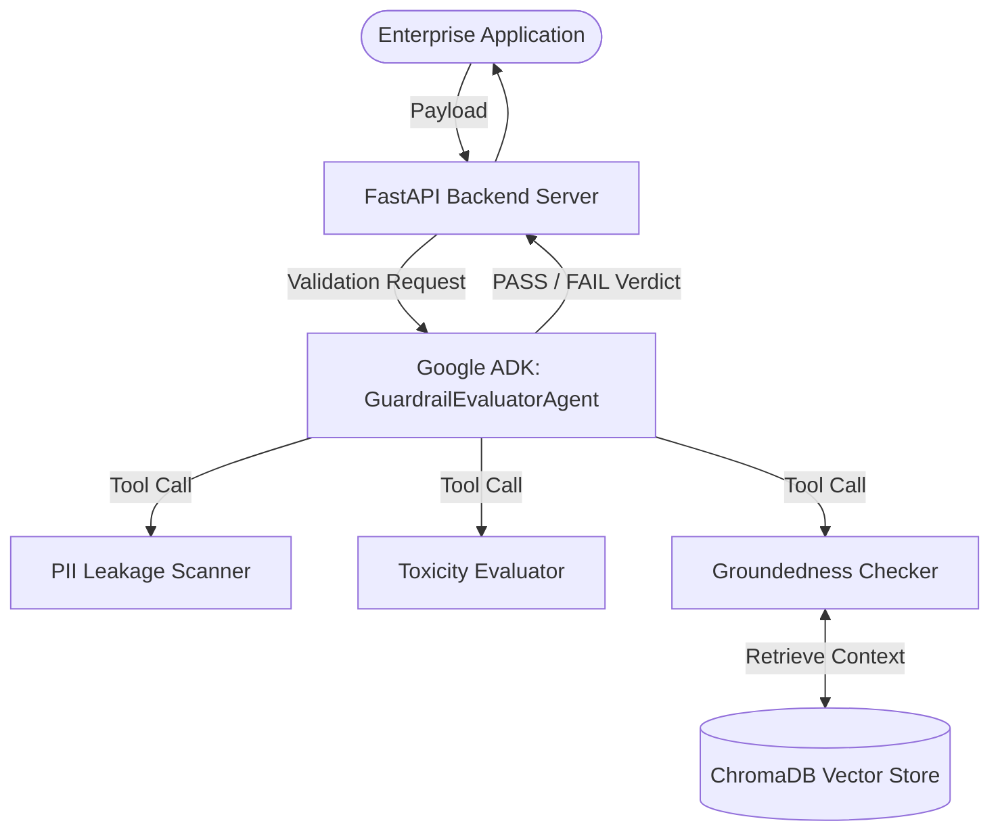

# 🛡️ Idea 1: GenAI Guardrail Factory
## TCS^AI Google Hackathon Technical Submission

> [!IMPORTANT]
> **Track:** : Build with Vertex (Google ADK Agents)  

---

## 1. Executive Summary & Problem Fit (20%)

### 🛑 The Problem
As enterprises race to deploy Generative AI, they face critical roadblocks: **hallucinations, PII data leaks, and off-brand/toxic outputs.** Traditional deployments rely on basic system prompts or simple Q&A wrappers, which lack the rigorous, deterministic testing required for production-grade security. 

### 💡 The Solution: GenAI Guardrail Factory
We built a dynamic, multi-layered "release gate" agent. Instead of merely answering user questions, the **GuardrailEvaluatorAgent** acts as a security sentry. It uses the Google Agent Development Kit (ADK) to dynamically evaluate, score, and remediate the outputs of *other* AI models against strict enterprise thresholds (Groundedness >= 85%, Toxicity >= 90%, PII >= 90%) before those outputs are allowed to reach the end-user.

> 📸 **[INSERT SCREENSHOT 1: Problem Fit]**
> *Insert a screenshot of your FastAPI Dashboard showing the visual 4-stage pipeline (Setup, Test Gen, Evaluate, Remediate) solving the business bottleneck.*

---

## 2. Novelty & Technical Sophistication (15%)

This project transcends basic API wrapping by leveraging **Custom Tool-Calling and Agentic Routing**. The ADK `LlmAgent` is empowered with precise Python functions that calculate deterministic security scores rather than relying solely on LLM semantics.

| Capability | Technical Execution | Impact |
| :--- | :--- | :--- |
| **Groundedness Checking** | RAG retrieval via ChromaDB vector embeddings | Prevents hallucinations by enforcing citation mapping. |
| **PII Data Scanning** | Regex and Pattern matching offloaded to a tool | Prevents unauthorized SSN, Email, or Key exposure. |
| **Toxicity Analysis** | Policy-driven sentiment grading | Ensures enterprise brand safety and compliance. |

> 📸 **[INSERT SCREENSHOT 2: Technical Sophistication]**
> *Insert a screenshot of the Terminal or Dashboard where the Agent outputs a "Remediation Plan", actively diagnosing and auto-fixing a failed PII test.*

---

## 3. Architecture & Scalability (20%)

Our architecture is built for the enterprise, utilizing a decoupled, modular design deployed on Google Cloud. 

> [!NOTE]
> ### 📸 Track 2: Code Architecture Checklist
> **[INSERT SCREENSHOT 3: Architecture]** 
> *Insert a screenshot of your JupyterLab / IDE showing the core logic of `agent.py` and the custom tool definitions inside `tools.py`.*

---

## 4. Security & Guardrails (15%)

Security is the native DNA of this project. The system enforces a strict **Human-in-the-Loop (HITL) Workflow**.

*   **Redaction & Prevention:** If the PII score falls below 0.90, the agent halts the pipeline, refuses to deploy the response, and generates a prompt-hardening strategy.
*   **Data Grounding:** The evaluating agent actively validates whether the target model hallucinated data outside the 6 enterprise source documents provided in the Data Store.

> 📸 **[INSERT SCREENSHOT 4: Security & Guardrails]**
> *Insert a screenshot of the `SYSTEM_PROMPT` in your code showing the explicit data privacy thresholds and deployment rules.*

---

## 5. Implementation Feasibility & Deployment (20%)

The system was developed strictly according to **Track 2 standards**—utilizing Vertex AI workspaces, the official Google ADK, and deployed natively to Google Cloud Run.

### 💻 Local Execution & Interaction
> 📸 **[INSERT SCREENSHOT 5: Local Execution]**
> *Insert a screenshot of your Lab Terminal running `adk run Vertex_ADK_Agent` and successfully interacting with the Guardrail agent (e.g., the Vikram PII failure).*

### ☁️ Cloud Containerization & Deployment
> 📸 **[INSERT SCREENSHOT 6: Deployment Success]**
> *Insert a screenshot of the Terminal showing the successful execution of the `adk deploy cloud_run Vertex_ADK_Agent` command building and containerizing the agent.*

### ✅ GCP Console Verification
> [!TIP]
> **[INSERT SCREENSHOT 7: Console Verification]**
> *Insert a screenshot of the Google Cloud Console (Cloud Run page) showing your agent `adk-default-service-name` listed as successfully deployed and serving traffic.*

### 🔍 Live Playground Validation
> 📸 **[INSERT SCREENSHOT 8: Live Validation]**
> *Insert a screenshot of a live test query executing in your hosted Dashboard or terminal, effectively showing the pipeline returning an accurate, grounded evaluation.*

---

## 6. Conclusion & Evidence Checklist (10%)

The GenAI Guardrail Factory is a deploy-ready, scalable asset for enterprise AI governance. By leveraging the **Google Agent Development Kit (ADK)**, we have successfully created a deterministic security gate that transforms risky Generative AI wrappers into compliant, enterprise-grade capabilities.

*All required screenshots showcasing the lab environment, terminal interactions, and GCP console verifications are embedded in the sections above.*
