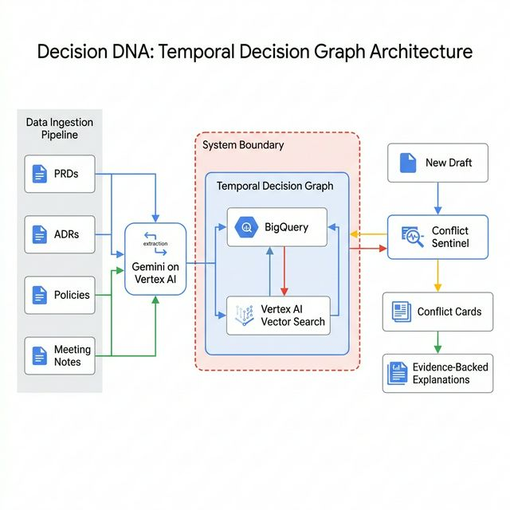

# Decision DNA — Idea 4

## Proactive Enterprise Memory & Temporal Decision Graph

**Google AI Track:** Intelligent Search & Gemini Enterprise
**Submission Date:** February 2026
**tcs^AI Google Hackathon 2026 — Ideathon Phase**

---

## 1. Executive Summary

**Decision DNA** is a Gemini-powered enterprise memory layer that converts scattered documents (PRDs, ADRs, meeting notes, policies) into a temporal decision graph. It preemptively blocks contradictory designs by automatically checking new drafts against the graph and generating evidence-backed "Conflict Cards" with traceability. This proactive approach saves time and money by preventing policy, SLA, and security violations before they are implemented.

---

## 2. Problem Statement

### The Challenge
Enterprises lose critical context because it lives across scattered artifacts (PRDs, ADRs, meeting notes, standards, runbooks, contractual clauses). Teams often repeat decisions, misunderstand the "why," and ship changes that unintentionally violate security policies or service obligations.

### Current State
| Aspect | Today's Reality |
|--------|----------------|
| **Search** | Keyword or basic semantic search returns entire documents, not specific decisions or constraints. |
| **Context** | The rationale for a decision gets lost soon after it's made. |
| **Compliance Checks** | Manual review processes that frequently miss subtle contradictions with existing policies or SLAs. |
| **Onboarding** | New engineers spend weeks piecing together why the architecture is the way it is. |

### Consequences of Inaction
- **Repeated mistakes** as teams recreate already discounted alternatives.
- **Compliance breaches** when a new feature violates a forgotten data retention policy.
- **SLA violations** when an architecture change breaks latency or availability obligations.
- **Wasted time** searching for approval lineage.

### Who Faces This Problem?
Any large enterprise, particularly those dealing with complex integration landscapes, stringent regulatory requirements, and high organizational churn.

---

## 3. Proposed Solution

### Core Concept
Decision DNA is a **proactive system** built on Vertex AI that builds a temporal graph of enterprise knowledge and actively checks new work against established constraints.

### Key Capabilities

#### 3.1 Temporal Decision Graph Ingestion
- Ingests non-confidential sources (design docs, ADRs, standards, meeting summaries).
- Uses **Gemini** to extract structured elements: decisions, alternatives, rationale, constraints, owners, dates, affected systems, and obligations.
- Stores these elements as a living graph connected to source evidence.

#### 3.2 Conflict Sentinel (Novelty Core)
When a user uploads a new PRD or architecture draft, Decision DNA automatically checks it against the graph and flags:
- **Security mismatch:** Data retention, encryption, access boundaries.
- **SLA/contract conflicts:** Latency, availability, reporting requirements.
- **Architecture violations:** Banned patterns, required platforms.

#### 3.3 Conflict Cards
Outputs clear, actionable "Conflict Cards" detailing:
- What the conflict is.
- Why it matters.
- Where it was originally approved (evidence linkage).
- Suggested compliant alternatives.

#### 3.4 "Ask Why" & Evidence-Backed Answers
Users can interactively query the graph:
- *"Why did we choose this approach?"*
- *"What constraints must not be broken?"*
Receiving cited explanations plus the complete decision lineage.

---

## 4. Architecture

### System Architecture Diagram


### Data Flow
```
┌─────────────────┐       ┌─────────────────┐       ┌─────────────────┐
│ Ingestion Layer │──────▶│ Extraction Core │──────▶│ Graph Storage   │
│ (ADRs, Policies,│       │ (Gemini AI)     │       │ (BigQuery +     │
│  Meeting Notes) │       │                 │       │  Vector Search) │
└─────────────────┘       └─────────────────┘       └─────────────────┘
                                                             │
                                                             ▼
┌─────────────────┐       ┌─────────────────┐       ┌─────────────────┐
│ User Interface  │◀──────│ Conflict        │◀──────│ New Drafts      │
│ (Conflict Cards,│       │ Sentinel        │       │ (PRDs, Auth)    │
│  Ask Why Query) │       │ (Reasoning)     │       │                 │
└─────────────────┘       └─────────────────┘       └─────────────────┘
```

### Google AI Technology Stack

| Component | Google Service | Purpose |
|-----------|---------------|---------|
| **Extraction & Reasoning** | Gemini on Vertex AI | Extracting decisions/obligations and conflict reasoning |
| **Search & Citations** | Vertex AI Search & Conversation | Conversational experience with exact document citations |
| **Semantic Linking** | Vertex AI Vector Search | Semantic linking across different artifacts |
| **Graph Store** | BigQuery + Network/Graph capabilities | Storing nodes (decisions, policies) and relationship edges |
| **Integration API** | Cloud Run | APIs for ingestion, conflict checks, and UI integration |
| **Data Safety** | Cloud DLP | Redaction and sensitive pattern detection |

---

## 5. Implementation Approach

### Phase 1: PoC (2-3 weeks)
- Ingest a fully synthetic/non-confidential sample set (~30 ADRs, 20 policies/standards, 10 SLA docs).
- Build the basic extraction pipeline using Gemini.
- Implement the "Ask Why" workflow.
- Simulate the "Conflict Sentinel" with 10 deliberate rule-breaking new drafts.

### Phase 2: MVP (4-6 weeks)
- Integrate with real document repositories (Google Drive, Confluence).
- Enhance the graph relations (dependency mapping).
- Deliver rich UI for Conflict Cards.
- Implement Cloud DLP for safe processing.

### Phase 3: Production (8-12 weeks)
- IDE and CI/CD integration (flagging architectural violations at PR time).
- Self-improving extraction based on user feedback.
- Team-level and Enterprise-level access controls via IAM.

---

## 6. Novelty & Differentiation

| Aspect | Generic Enterprise Search | Decision DNA |
|--------|--------------------------|--------------|
| **Output Type** | Entire documents and passages. | Specific decisions, constraints, and relationships. |
| **Stance** | Passive (waits for queries). | Proactive (scans drafts and flags issues). |
| **Context** | Sees text as strings. | Understands text as semantic policies & obligations. |
| **Result Format** | Ten blue links. | Specific Conflict Cards and cited explanations. |

### Why This Idea Is Unique
Unlike standard RAG apps, Decision DNA builds a structural understanding of an enterprise's intent, stopping bad designs before code is even written. It treats the "why" as a first-class citizen.

---

## 7. Business Value

### Quantitative Impact
- **Fewer policy/SLA violations** found late in the delivery lifecycle.
- **Reduces rework** by catching architectural or compliance conflicts early (shifting left).
- **Faster onboarding**, drastically reducing the time required to locate design rationales.

### Strategic Value for TCS
- **Differentiated Offering:** positions TCS as a leader in applying GenAI beyond simple chatbots into true "Enterprise Intelligence."
- **Trust & Compliance:** Assures clients that complex regulatory and architectural standards are preemptively enforced.
- **Knowledge Continuity:** Creates a reusable enterprise memory that survives employee attrition.

---

## 8. Security & Compliance

| Aspect | Implementation |
|--------|---------------|
| **Data Redaction** | Cloud DLP masks sensitive attributes before ingestion. |
| **Access Control** | Document-level ACLs enforced via Cloud IAM. |
| **Hallucination Mitigation** | Citations-first responses forcing grounding in source graphs. |
| **Audit Logs** | Complete history of who queried what and which drafts triggered conflicts. |

### Responsible AI Practices
- **Safety Guidelines:** Strict adherence to Google AI principles, processing only safe, redacted data.
- **Transparency:** "Ask Why" explicitly traces every assertion back to the original source document, ensuring transparent reasoning.
- **No Customer PII:** The PoC uses strictly synthetic organizational data.

---

## 9. PoC Demonstration Plan

### Demo Flow
1. **The Graph View:** Show the visual Temporal Decision Graph, establishing the baseline policies and past decisions.
2. **Uploading a Draft:** Upload a new "Authentication Service PRD" that mistakenly proposes a 30-day data retention standard.
3. **Conflict Detection:** The Sentinel intervenes, generating a **Conflict Card** highlighting a clash with the "Global 90-Day Retention Policy."
4. **Resolution via 'Ask Why':** User asks "Why do we need 90 days?" and receives a cited explanation linking to the exact regulatory compliance document.
5. **Dashboard:** Show the reduction in missed conflicts (before vs. after Sentinel activation).

### Success Metrics
- % of seeded conflicts detected before implementation.
- Reduction in time to locate "why" for past approvals.
- User trust measured via citation correctness rate.

---

## 10. References
- Vertex AI Vector Search: <https://cloud.google.com/vertex-ai/docs/vector-search/overview>
- Gemini on GCP: <https://cloud.google.com/vertex-ai/docs/generative-ai/learn/overview>
- Architecture Decision Records (ADR): <https://cognitect.com/blog/2011/11/15/documenting-architecture-decisions>

---
*This document is submitted as part of the tcs^AI Google Hackathon 2026 — Ideathon Phase. All data used is synthetic. No real client names, PII, or confidential information is included.*
