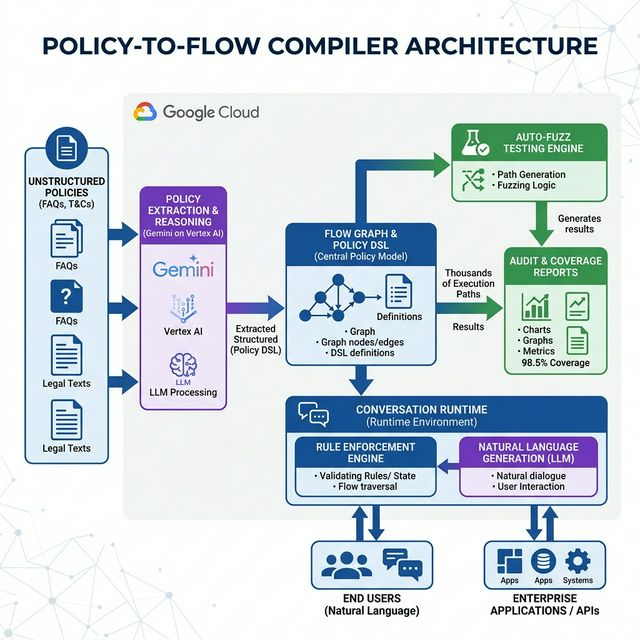

# Policy-to-Flow Compiler
## AI-Driven Deterministic Conversation Workflows

**Google AI Track:** Customer Engagement Suite  
**Submission Date:** February 2026  
**tcs^AI Google Hackathon 2026 — Ideathon Phase**

---

## 1. Executive Summary

**Policy-to-Flow Compiler (PFC)** is an enterprise Gemini + Vertex AI system that bridges the gap between unstructured business policies and automated customer engagement. It translates human-readable policies (refunds, warranties, KYC) into machine-enforceable conversation graphs and tests them with automated fuzzing. By separating decisioning logic from natural language generation, PFC guarantees zero compliance hallucinations while enabling audit-ready, scalable AI deployment.

---

## 2. Problem Statement

### The Challenge
Enterprises struggle to scale AI-driven customer engagement because policy content is unstructured, frequently updated, and interpreted inconsistently across channels. Traditional chatbots and standard RAG assistants are prone to applying the wrong eligibility rules or producing non-compliant commitments, which creates immense legal and brand risks.

### Current State vs. PFC Capability
| Aspect | Standard AI Chatbots | Policy-to-Flow Compiler |
|--------|----------------------|-------------------------|
| **Decision Making** | Relies on LLM reasoning (prone to hallucinations). | Relies on deterministic Flow Graphs. |
| **Testing** | Manual testing of limited edge cases. | Auto-fuzz testing of thousands of paths. |
| **Evidence** | Difficult to definitively prove rule adherence. | Audit-ready output linking decisions to policy. |
| **Updates** | Retraining or re-indexing taking days to verify. | Recompilation and automated regression testing in hours. |

### Consequences of Inaction
- **Financial Risk:** Issuing unauthorized refunds or accepting invalid claims.
- **Brand Damage:** Giving incorrect policy information leading to poor customer experience.
- **Legal/Compliance Risk:** Failing to state mandatory disclaimers during regulated interactions.

### Who Faces This Problem?
Highly regulated industries (BFSI, Healthcare), e-commerce giants, and any large B2C organization managing complex eligibility frameworks and policies.

---

## 3. Proposed Solution

### Core Concept
Instead of trusting the LLM to interpret policy, PFC compiles policy text into an executable decision engine. AI is strictly constrained to safe operational boundaries: text summarization, user intent classification, and entity extraction. 

### Key Capabilities

#### 3.1 Compile Policies into an Executable "Flow Graph"
- Ingests policy sources (FAQs, T&Cs excerpts, escalation matrices).
- Gemini extracts entities, conditional logic, required disclaimers, and triggers.
- Compiles a deterministic **Flow Graph + Policy Rule DSL** that the conversational agent must strictly follow.

#### 3.2 Conversation Runtime
- The compiled configuration delegates **"what to do next"** to the deterministic Policy Engine.
- The LLM is constrained to generating **"how to say it"**, maintaining conversational empathy and tone without altering the authorized outcome.

#### 3.3 Auto-Fuzz Testing & Compliance Proof (Novelty Core)
- Generates thousands of synthetic customer conversation paths.
- Catches edge case gaps (e.g., overlapping date rules) and logical contradictions.
- Produces an executive audit pack containing coverage reports, diffs, and proof of compliance.

#### 3.4 Rapid Update Pipeline
When underlying policy documents change, PFC highlights the impacted nodes in the conversational flow and executes targeted regression fuzzing, reducing update cycles from weeks to hours.

---

## 4. Architecture

### System Architecture Diagram


### Data Flow
```
┌─────────────────┐       ┌─────────────────┐       ┌──────────────────┐
│  Policy Source  │──────▶│ Compiler Engine │──────▶│ Flow Graph / DSL │
│  (T&Cs, FAQs)   │       │ (Gemini)        │       │ (Versioned)      │
└─────────────────┘       └─────────────────┘       └──────────────────┘
                                                             │
                      ┌──────────────────────────────────────┴─────────┐
                      ▼                                                ▼
            ┌───────────────────┐                            ┌───────────────────┐
            │ Auto-Fuzz Tester  │                            │ Runtime Execution │
            │ (GenAI Scenarios) │                            │ (Vertex Agent)    │
            └─────────┬─────────┘                            └───────────────────┘
                      ▼
            ┌───────────────────┐
            │ Audit Pack & CI   │
            │ (Coverage Reports)│
            └───────────────────┘
```

### Google AI Technology Stack

| Component | Google Service | Purpose |
|-----------|---------------|---------|
| **Extraction & Parser** | Gemini on Vertex AI | Parsing policies and extracting formal rules to DSL |
| **Orchestration** | Vertex AI Pipelines | Compile → Validate → Fuzz Test → Publish workflow |
| **Execution** | Cloud Run | Deterministic rule engine and graph runtime API |
| **Conversational Agent**| Vertex AI Conversation | Agent Builder runtime constrained by the graph |
| **Persistence** | BigQuery | Store flow versions, audit reports, and test results |
| **Simulation** | Gemini on Vertex AI | Generating synthetic user input for fuzzing |

---

## 5. Implementation Approach

### Phase 1: PoC (2-3 weeks)
- Utilize a synthetic "warranty & returns policy" document suite.
- Build the core Gemini extraction prompt to generate the DSL diagram.
- Simulate the runtime constraints using a custom chat UI.
- Execute a 500-conversation Auto-Fuzz run.

### Phase 2: MVP (4-6 weeks)
- Expand the extraction engine to handle overlapping or contradictory rules.
- Integrate directly with Vertex AI Agent Builder.
- Build internal dashboards for policy diff reviews and audit reporting.

### Phase 3: Production (8-12 weeks)
- API integration with enterprise CRM and Knowledge Management platforms.
- Continuous CI/CD style deployment for policy changes.
- Rollout across multimodal interfaces (Chat, Voice, Email workflows).

---

## 6. Novelty & Differentiation

| Aspect | Standard Support Chatbots | Policy-to-Flow Compiler |
|--------|---------------------------|-------------------------|
| **Logic Foundation**| Probabilistic neural generation. | Deterministic structured graphs. |
| **Testing Paradigm**| Human QA testing scripts. | Software-style automated parallel fuzzing. |
| **Safety Guarantees**| Best-effort prompt engineering. | Structurally impossible to output off-graph actions. |
| **Agility** | Opaque retraining cycles. | Clear, version-controlled diffs mapping logic changes. |

### Why This Idea Is Unique
It introduces Software Engineering CI/CD rigor (compilation, static analysis, fuzz testing) to conversational AI policy enforcement. It recognizes that "vibes" aren't good enough for legal T&Cs.

---

## 7. Business Value

### Quantitative Impact
- **0 "disallowed outcome" rate** due to strictly enforced determinism.
- **Turnaround time reduced from weeks to hours** for deploying regulatory or operational policy updates safely.
- **Decreased escalation volumes** by standardizing precise responses out-of-the-box.

### Strategic Value for TCS
- **Scale Confidence:** Allows TCS to deploy large-scale agentic systems for risk-averse, highly regulated clients.
- **Audit Defensibility:** Produces tangible compliance artifacts to defend AI output.
- **Differentiation:** Positions TCS as prioritizing concrete governance frameworks over generic generative chat.

---

## 8. Security & Compliance

| Aspect | Implementation |
|--------|---------------|
| **Data Usage** | PoC runs on synthetic organizational data; strict boundary ensuring no user PII leaks into rulesets. |
| **Audit Trails** | Every bot outcome is explicitly linked to a node in the version-controlled DSL. |
| **Escalations** | Uncertainty parameters force human fallbacks when a flow hits undefined edges. |
| **RBAC** | Flow deployment approvals are gate-kept by Cloud IAM. |

### Responsible AI Practices
- **Deterministic Reliability:** Removing GenAI reasoning from mission-critical judgments ensures fairness and reliability.
- **Transparency:** The fuzzer produces readable coverage statistics.
- **Accountability:** System clearly attributes responses to the governing human-written policy rule.

---

## 9. PoC Demonstration Plan

### Demo Flow
1. **The Policy Compiler:** Show the ingestion of an unstructured Return Policy document and its live compilation into a visual Flow Graph.
2. **The Fuzz Tester:** Initiate a hyper-speed fuzzer that iterates 500 simulated user attempts. Demonstrate the dashboard catching a "Loophole" (e.g., conflicting dates) and generating a Coverage Report.
3. **The Conversation Runtime:** A split-screen chat interface. On the left, the user converses with the bot. On the right, an "X-Ray" panel illuminates the exact graph nodes and policy constraints controlling the Gemini output in real-time.

### Success Metrics
- 100% adherence to deterministic bounds in unit tests.
- High generation success for the Policy DSL from unstructured documents.
- Demonstrably faster visual verification compared to manual document review.

---

## 10. References
- Vertex AI Agent Builder: <https://cloud.google.com/products/agent-builder>
- AI Fuzzing Concepts: <https://owasp.org/www-project-machine-learning-security-top-10/>
- Google Cloud CI/CD: <https://cloud.google.com/architecture/cicd-for-machine-learning>

---
*This document is submitted as part of the tcs^AI Google Hackathon 2026 — Ideathon Phase. All data used is synthetic. No real client names, PII, or confidential information is included.*
